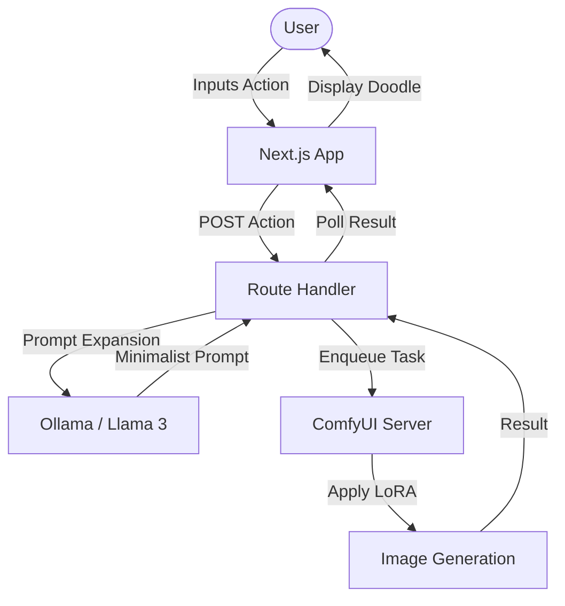

# 🎨 Sketch Engine: Action-to-Doodle Pipeline

Sketch Engine is a full-stack experimental platform that transforms simple user actions into minimalist, child-style doodles. It leverages the power of **Llama 3** for intelligent prompt expansion and **ComfyUI** for high-quality, stylized image generation.

---

## 🚀 Key Features

- **💡 Intelligent Prompting**: Uses Ollama (Llama 3) to expand simple action words (e.g., "coding", "singing") into detailed, minimalist scene descriptions.
- **🖌️ Stylized Generation**: Utilizes a specialized LoRA (`child-drawing.safetensors`) within ComfyUI to produce consistent, single-stroke black-and-white doodles.
- **⚡ Real-time Feedback**: A Next.js frontend that communicates via WebSockets to provide asynchronous generation status and instant results.
- **🔗 Flexible Integration**: Built on top of the `@stable-canvas/comfyui-client` for robust communication with local or remote ComfyUI instances.

---

## 🏗️ Architecture



---

## 🛠️ Prerequisites

- **Next.js**: 14.x
- **ComfyUI**: Local server running (default: `127.0.0.1:8188`).
- **Ollama**: Running locally with the `llama3` model (default: `http://localhost:11434`).
- **LoRA**: [child-drawing.safetensors](https://civitai.com/models/127110/child-drawing-style-lora) placed in your ComfyUI models folder.

---

## 🏃 Getting Started

1. **Clone and Install**:
```bash
npm install
```

2. **Start ComfyUI**:
Ensure your ComfyUI server is running and accessible. Update the `comfy_host` in `src/app/api/route.ts` if necessary.

3. **Start Ollama**:
```bash
ollama run llama3
```

4. **Launch the Service**:
```bash
npm run dev
```

Visit [http://localhost:3000](http://localhost:3000) to start doodling!

---

## 🗺️ Roadmap

- [ ] Replace internal logging with the `debug` library.
- [ ] Containerize the entire stack for easy deployment.
- [ ] Implement one-click deployment to **RunPod**.
- [ ] Expand the UI to support multi-step workflows.
- [ ] Contribute to or refine the `@stable-canvas/comfyui-client`.

---

## 🖼️ Example Output


---

*Built with ❤️ for the doodle experiment.*
